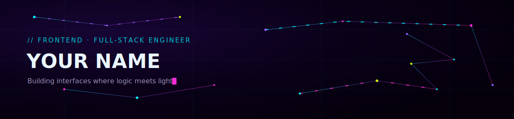

<!--
  使用说明（不会显示在主页上）：
  1. 全局替换 YOUR_USERNAME -> 你的 GitHub 用户名
  2. 打开 assets/header.svg，把 "YOUR NAME" 和 tagline 文字改成你自己的
  3. 项目展示卡片部分，把 REPO_ONE / REPO_TWO / REPO_THREE / REPO_FOUR 换成你的仓库名
  4. 联系方式部分按需删改链接
-->

<div align="center">



<br/>


</div>

<br/>

## ⌁ About

```js
const dev = {
  role: "Frontend / Full-Stack Engineer",
  focus: ["interfaces", "performance", "developer experience"],
  philosophy: "code is just light, shaped",
  currentlyExploring: "edge rendering & generative UI",
};
```

我喜欢把界面当作一种"可触摸的逻辑"——少一点装饰，多一点意图。这个主页本身也是这种思路的产物：抽象、暗色、带一点不安分的荧光。

<br/>

## ⌁ Stack

<div align="center">

**Languages**


**Frontend**


**Backend & Tools**


</div>

<br/>

## ⌁ Stats

<div align="center">


</div>

<br/>

## ⌁ Selected Work

<table align="center" width="100%">
<tr>
<td width="50%">

</td>
<td width="50%">

</td>
</tr>
<tr>
<td width="50%">

</td>
<td width="50%">

</td>
</tr>
</table>

<br/>

## ⌁ Connect

<div align="center">

<a href="mailto:your.email@example.com"></a>
<a href="https://www.linkedin.com/in/YOUR_USERNAME"></a>
<a href="https://twitter.com/YOUR_USERNAME"></a>
<a href="https://your-site.dev"></a>

</div>

<div align="center">
<sub>designed in the dark, lit up in neon</sub>
</div>
